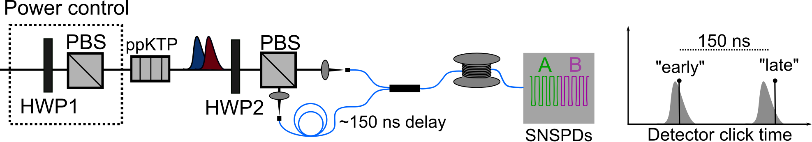

# SPDC_GroupDelay

Analysis code and raw data for the paper: [Gain-induced group delay in spontaneous parametric down-conversion](https://arxiv.org/abs/2405.07909)

Requires packages numpy, scipy, matplotlib, tqdm, lmfit, strawberryfields, thewalrus, NeedALight, seaborn

## Raw data structure

The data recorded from the TimeTagger is saved in the folder data.zip. A rough schematic of the setup is shown below:

The detector is a two-element (i.e. two multiplexed) superconducting nanowire single photon detector.

The pump power is varied by rotating half-wave plate 1 (HWP1), while HWP2 alternates between: (i) HWP2=2.0 deg, splitting signal and idler at the polarizing beam spliter (PBS), or (ii) HWP2=24.5 deg, mixing signal and idler at the polarizing beam spliter. Interferograms are observed in the latter case.

For each HWP1/HWP2 angle, the recorded timetags are stored in text files labelled by e.g. "AE.txt" (singles at detector A early bin) or "AE_BE_BL.txt" (concidences between detector A early bin & detector B early bin & detector B late bin).

If timing info not needed, the number of events are stored in the text file "clicks.txt". The format for clicks.txt is:

[[numTrigs],
[AE, BE, AL, BL],
[BE_AL, BE_BL, AE_BE, AL_BL],
[AE_AL_BE, AE_AL_BL, AE_BE_BL, AL_BE_BL],
[AE_AL_BE_BL]]

The pump spectrum after the ppKTP crystal is also saved in the file pumpSpectrum.txt
